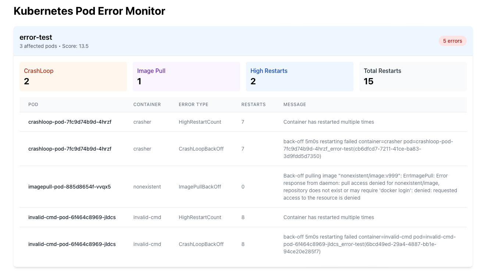

# Kubernetes Pod Error Monitor

A real-time monitoring tool for Kubernetes pod errors with a clean, modern UI that helps you quickly identify and troubleshoot problematic pods across your clusters.

## Features

- **Real-time Monitoring**: Automatically refreshes every 5 seconds
- **Error Scoring**: Prioritizes issues based on severity
  - CrashLoopBackOff: 3 points
  - ImagePull issues: 2 points
  - High restart count: 2 points
  - Other errors: 1 point
  - Each restart: 0.1 points

- **Error Types Tracked**:
  - CrashLoopBackOff
  - ImagePullBackOff
  - High Restart Counts (>5)
  - Failed Pods
  - Container Creation Errors

- **Per-Namespace Statistics**:
  - Total error count
  - Unique affected pods
  - Error type breakdown
  - Total restart count
  - Severity score

## Example Output

As shown in the screenshot, the tool provides:

1. **Namespace Overview**:
   - Namespace name (e.g., "error-test")
   - Number of affected pods (e.g., "3 affected pods")
   - Error score (e.g., "Score: 13.5")
   - Total error count (e.g., "5 errors")

2. **Error Type Breakdown**:
   - CrashLoop: 2 instances
   - Image Pull: 1 instance
   - High Restarts: 2 instances
   - Total Restarts: 15

3. **Detailed Pod Information**:
   - Pod name
   - Container name
   - Error type
   - Restart count
   - Detailed error messages

## Architecture

- **Backend**: Go service using the official Kubernetes client-go
- **Frontend**: React with Tailwind CSS for styling
- **API**: RESTful endpoints for namespace and pod data
- **Kubernetes**: Uses in-cluster configuration for secure cluster access